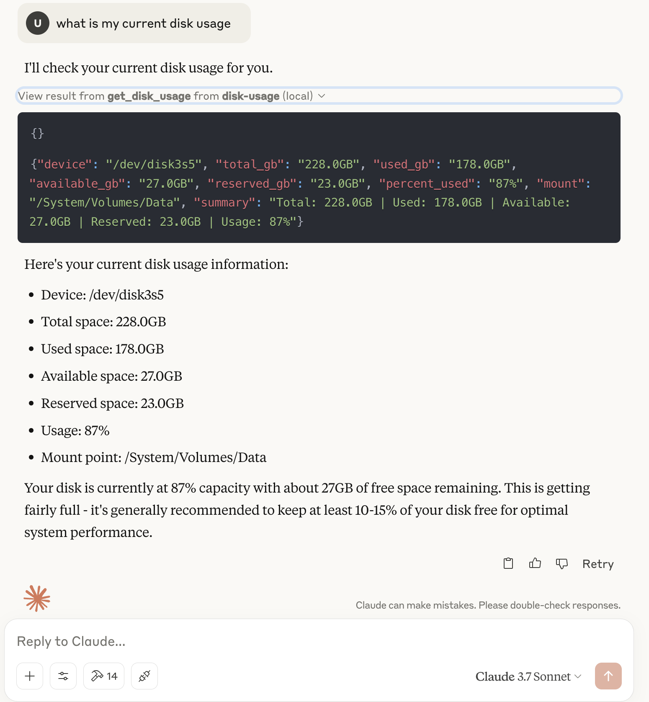

# Disk Usage MCP Server (Demo)

## What is MCP?

Model Context Protocol (MCP) is a protocol that enables AI models like Claude to interact with external tools and services. It allows Claude to access real-time system information and perform actions on your behalf. 

Learn more about MCP:

- [MCP Documentation](https://modelcontextprotocol.io/docs/)
- [MCP Python SDK](https://modelcontextprotocol.io/docs/sdks/python)

## What You Get

When integrated with Claude Desktop, this demo MCP server enables Claude to check your disk usage (on the Mac) in real-time. Here's an example interaction:



User: "What is my current disk usage?"

Claude: "Let me check your current disk usage for you."

[approval to use disk-usage tool, user gives consent]

<details>
<summary>View result from ```get_disk_usage``` from ```disk-usage``` (local)</summary>

```json
{
    "device": "/dev/disk3s5",
    "total_gb": "228.0GB",
    "used_gb": "177.0GB",
    "available_gb": "27.0GB",
    "reserved_gb": "24.0GB",
    "percent_used": "87%",
    "mount": "/System/Volumes/Data",
    "summary": "Total: 228.0GB | Used: 177.0GB | Available: 27.0GB | Reserved: 24.0GB | Usage: 87%"
}
```
</details>

Claude: "Here's your current disk usage information:

Total Disk Space: 228.0GB   
Used Space: 177.0GB   
Available Space: 27.0GB   
Reserved Space: 24.0GB   
Usage Percentage: 87%   
Mount Point: /System/Volumes/Data   
Device: /dev/disk3s5

Your disk is currently at 87% capacity, with 27.0GB of space still available. If you're concerned about the high usage, you might want to consider cleaning up some files to free up more space."

## How It Works

### Server Capabilities

When the server starts, it advertises its capabilities to Claude through the MCP protocol. Here's what Claude sees:

```python
@mcp.tool()
def get_disk_usage() -> Dict[str, str]:
    """Get current disk usage information for the system disk
    
    Returns:
        A dictionary containing disk usage information with fields:
        - device: Device name
        - total_gb: Total size in GB
        - used_gb: Used space in GB
        - available_gb: Available space in GB
        - reserved_gb: Space reserved by system in GB
        - percent_used: Usage percentage
        - mount: Mount point
        - summary: Human-readable summary of disk usage
    """
```

This tells Claude that:

1. The server provides a tool called `get_disk_usage`
2. The tool returns a dictionary with detailed disk information
3. The docstring explains what each field means

### The Complete Claude-MCP Interaction Flow

1. **Initial System Prompt to Claude**:
```
You are Claude, an AI assistant. You have access to these tools:

get_disk_usage() -> Dict[str, str]
    "Get current disk usage information for the system disk"

To use this tool, respond with a <tool_call> XML block:
<tool_call>
<name>get_disk_usage</name>
<reason>Explain why you need disk usage information</reason>
</tool_call>
```

2. **User Query**:
```
User: What is my current disk usage?
```

3. **Claude's Tool Selection Response**:
```
I'll check your disk usage information.

<tool_call>
<name>get_disk_usage</name>
<reason>User has requested current disk usage information. This tool will provide detailed statistics about disk space utilization.</reason>
</tool_call>
```

4. **Claude Desktop App → MCP Server**:
```json
// HTTP POST to MCP Server
{
    "jsonrpc": "2.0",
    "method": "invoke",
    "params": {
        "tool": "get_disk_usage",
        "args": {}
    },
    "id": 1
}
```

5. **MCP Server → Claude Desktop App**:
```json
{
    "jsonrpc": "2.0",
    "result": {
        "device": "/dev/disk3s5",
        "total_gb": "228.0GB",
        "used_gb": "177.0GB",
        "available_gb": "27.0GB",
        "reserved_gb": "24.0GB",
        "percent_used": "87%",
        "mount": "/System/Volumes/Data",
        "summary": "Total: 228.0GB | Used: 177.0GB | Available: 27.0GB | Reserved: 24.0GB | Usage: 87%"
    },
    "id": 1
}
```

6. **New Request to Claude** (with tool output as context):
```
User: What is my current disk usage?

Tool Response:
{
    "device": "/dev/disk3s5",
    "total_gb": "228.0GB",
    "used_gb": "177.0GB",
    "available_gb": "27.0GB",
    "reserved_gb": "24.0GB",
    "percent_used": "87%",
    "mount": "/System/Volumes/Data",
    "summary": "Total: 228.0GB | Used: 177.0GB | Available: 27.0GB | Reserved: 24.0GB | Usage: 87%"
}

Provide a helpful response to the user based on this disk usage information.
```

7. **Claude's Final Response**:
```
Here's your current disk usage information:

Total Disk Space: 228.0GB   
Used Space: 177.0GB   
Available Space: 27.0GB   
Reserved Space: 24.0GB   
Usage Percentage: 87%   
Mount Point: /System/Volumes/Data   
Device: /dev/disk3s5

Your disk is currently at 87% capacity, with 27.0GB of space still available. If you're concerned about the high usage, you might want to consider cleaning up some files to free up more space.
```

This shows the complete flow:
1. Claude starts with knowledge of available tools
2. User asks a question
3. Claude recognizes the need for disk info and proposes using the tool
4. After approval, tool response is injected into the conversation
5. Claude processes the raw data into a helpful response

### Technical Implementation
   ```python
   # Tool advertisement from server
   {
     "tools": [
       {
         "name": "get_disk_usage",
         "description": "Get current disk usage information for the system disk",
         "parameters": {},  # No parameters needed
         "returns": {
           "type": "object",
           "properties": {
             "device": {"type": "string"},
             "total_gb": {"type": "string"},
             "used_gb": {"type": "string"},
             "available_gb": {"type": "string"},
             "reserved_gb": {"type": "string"},
             "percent_used": {"type": "string"},
             "mount": {"type": "string"},
             "summary": {"type": "string"}
           }
         }
       }
     ]
   }
   ```

2. **User Query**:
   ```
   User: "What is my current disk usage?"
   ```

3. **Claude's Tool Selection**:
   Claude recognizes this query requires disk information and decides to use the `get_disk_usage` tool.
   ```
   Claude: "Let me check your current disk usage for you."
   [approval to use disk-usage tool, user gives consent]
   ```

4. **Tool Invocation and Response**:
   ```json
   // Raw tool response
   {
     "device": "/dev/disk3s5",
     "total_gb": "228.0GB",
     "used_gb": "177.0GB",
     "available_gb": "27.0GB",
     "reserved_gb": "24.0GB",
     "percent_used": "87%",
     "mount": "/System/Volumes/Data",
     "summary": "Total: 228.0GB | Used: 177.0GB | Available: 27.0GB | Reserved: 24.0GB | Usage: 87%"
   }
   ```

5. **Claude's Natural Response**:
   Claude processes the raw data and provides a human-friendly response:
   ```
   Here's your current disk usage information:

   Total Disk Space: 228.0GB   
   Used Space: 177.0GB   
   Available Space: 27.0GB   
   Reserved Space: 24.0GB   
   Usage Percentage: 87%   
   Mount Point: /System/Volumes/Data   
   Device: /dev/disk3s5

   Your disk is currently at 87% capacity, with 27.0GB of space still available. If you're concerned about the high usage, you might want to consider cleaning up some files to free up more space."
   ```

### Communication Protocol

Under the hood, MCP uses a bidirectional JSON-RPC protocol over WebSocket. Here's how it works:

1. **Initialization**:
   ```json
   // Claude -> Server
   {
     "jsonrpc": "2.0",
     "method": "initialize",
     "params": {
       "protocolVersion": "2024-11-05",
       "capabilities": {},
       "clientInfo": {
         "name": "claude-ai",
         "version": "0.1.0"
       }
     },
     "id": 0
   }
   ```

2. **Tool Advertisement**:
   The server responds with its capabilities, including the `get_disk_usage` tool and its schema.

3. **Tool Invocation**:
   ```json
   // Claude -> Server
   {
     "jsonrpc": "2.0",
     "method": "invoke",
     "params": {
       "tool": "get_disk_usage",
       "args": {}
     },
     "id": 1
   }
   ```

4. **Server Response**:
   ```json
   // Server -> Claude
   {
     "jsonrpc": "2.0",
     "result": {
       "device": "/dev/disk3s5",
       "total_gb": "228.0GB",
       "used_gb": "177.0GB",
       ...
     },
     "id": 1
   }
   ```

This WebSocket-based protocol allows for:
- Persistent connections
- Bidirectional communication
- Structured type information
- Tool discovery and documentation

### Implementation

1. The MCP server (`disk_usage_server.py`) uses Python's `subprocess` module to run the `df` command
2. It specifically looks at the `/System/Volumes/Data` partition (disk3s5 on macOS)
3. The server parses the output and returns structured data including:
   - Total disk space
   - Used space
   - Available space
   - Reserved space (space reserved by the system)
   - Usage percentage
   - Mount point and device information

## Requirements

- macOS (this tool is specifically designed for Mac's disk structure)
- Python 3.11+
- pip (Python package manager)

## Running the Server

1. Clone this repository

2. Install dependencies:
```bash
pip install -r requirements.txt
```

3. Run the server:
```bash
python disk_usage_server.py
```

**Note**: This server specifically looks for the `/System/Volumes/Data` partition (disk3s5) on macOS. It will not work on other operating systems.

## Claude Desktop Integration

1. Create a `claude-config.txt` file in your Claude Desktop configuration directory (usually `~/.config/claude-desktop/` on macOS) with:
```json
{
  "mcpServers": {
    "disk-usage": {
      "command": "python3",
      "args": [
        "<path-to-your-directory>/disk_usage_server.py"
      ]
    }
  }
}
```

2. Replace `<path-to-your-directory>` with the actual path to where you saved the server files

3. Restart Claude Desktop

## Learning Outcomes

This project demonstrates:
1. How to create a simple MCP server using Python
2. How to integrate system commands into an MCP tool
3. How to structure data for AI consumption
4. How to handle system-specific details (like disk partitions)
5. How to provide clear, human-readable summaries of technical data

## Files
- `disk_usage_server.py`: The main MCP server implementation
- `requirements.txt`: Python dependencies
- `claude-config.txt`: Example Claude Desktop configuration
